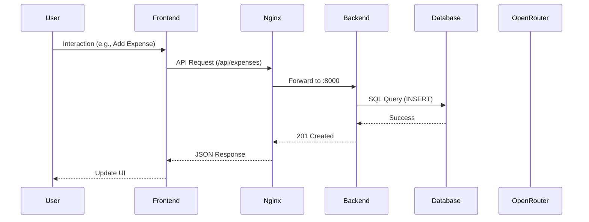

# System Architecture

## Overview
The Personal Finance Management system follows a containerized microservices-lite architecture, focusing on separation of concerns between UI, Business Logic, and Data Persistence.

## Components
- **Frontend (React)**: Served via Nginx, handles UI state and routing.
- **Backend (FastAPI)**: RESTful API handling business logic and DB orchestration.
- **Database (PostgreSQL)**: Persistent relational storage.
- **Cache (Redis)**: Temporary data storage for session/performance.
- **AI Gateway (OpenRouter)**: External service for LLM integration.

## Request Flow

## AI Analysis Flow
1. User clicks "Generate Analysis".
2. Backend gathers transaction data for the period.
3. Backend formats data into a prompt template.
4. Backend sends request to OpenRouter.
5. OpenRouter streams response back to Backend.
6. Backend saves analysis to Database and returns to Frontend.

## Infrastructure
Orchestrated via **Docker Compose**, utilizing a shared bridge network (`finance_network`) and named volumes for database persistence.
