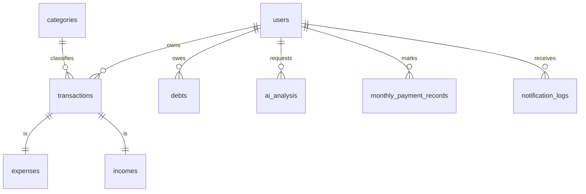

# Database Schema

The system uses PostgreSQL for relational data storage and AI analysis records.

## Core Tables

### users
- `id`: UUID (Primary Key)
- `username`: String (Unique)
- `email`: String (Optional, Unique)
- `hashed_password`: String
- `created_at`: Timestamp
- `updated_at`: Timestamp

### transactions (Abstract / Polymorphic)
- `id`: UUID (Primary Key)
- `user_id`: UUID (Foreign Key → users)
- `amount`: Decimal
- `description`: String
- `date`: Date
- `category_id`: UUID (Foreign Key → categories)
- `type`: Enum (income, expense)

### expenses (Inherits Transaction Logic)
- `id`: UUID
- `category`: String
- `payment_method`: String

### incomes (Inherits Transaction Logic)
- `id`: UUID
- `source`: String

### debts
- `id`: UUID
- `user_id`: UUID (Foreign Key → users)
- `amount`: Decimal
- `lender_borrower`: String
- `due_date`: Date
- `status`: Enum (active, paid)
- `type`: Enum (debt, loan)

### ai_analysis
- `id`: UUID
- `user_id`: UUID (Foreign Key → users)
- `content`: Text (Markdown)
- `period`: String (e.g., "2024-05")
- `created_at`: Timestamp

### monthly_payment_records ← NEW
Tracks whether a recurring debt/expense has been marked as paid for a given month. This is a "checkbox" record, not a financial entry.
- `id`: UUID (Primary Key)
- `user_id`: UUID (Foreign Key → users) — required for multi-user safety
- `source_type`: Enum (`debt` | `expense`)
- `source_id`: UUID — references debts.id or expenses.id
- `period_key`: VARCHAR(7) — format: `YYYY-MM`
- `status`: Enum (`paid` | `unpaid`) — default `paid` when created
- `note`: TEXT (nullable) — optional note when marking
- `marked_at`: TIMESTAMP — when user first marked
- `created_at`: TIMESTAMP
- `updated_at`: TIMESTAMP
- **Unique constraint**: `(user_id, source_type, source_id, period_key)`
- **Pattern**: UPSERT (`INSERT ... ON CONFLICT DO UPDATE`) — never deletes rows

### notification_logs ← NEW
History of all scheduler-sent notifications, one row per channel per send attempt.
- `id`: UUID (Primary Key)
- `user_id`: UUID (Foreign Key → users)
- `period_key`: VARCHAR(7) — which month's report
- `channel`: Enum (`email` | `telegram`)
- `status`: Enum (`success` | `failed` | `retrying`)
- `attempt_count`: INTEGER (default 1)
- `error_message`: TEXT (nullable) — last error if failed
- `sent_at`: TIMESTAMP (nullable) — null if failed
- `created_at`: TIMESTAMP

## Relationship Diagram (Conceptual)

## Design Patterns
- **Soft Delete**: Using `deleted_at` column to preserve data history.
- **Timestamp Mixin**: All tables include `created_at` and `updated_at` for auditing.
- **Async SQLAlchemy**: High-performance database interaction using `asyncpg`.
- **UPSERT pattern**: `monthly_payment_records` uses `INSERT ... ON CONFLICT DO UPDATE` for idempotent toggling.

