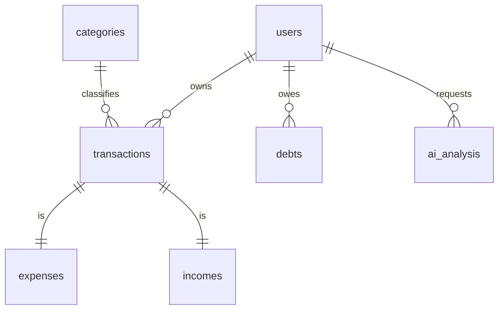

# Database Schema

The system uses PostgreSQL for relational data storage and AI analysis records.

## Core Tables

### users
- `id`: UUID (Primary Key)
- `username`: String (Unique)
- `email`: String (Optional, Unique)
- `hashed_password`: String
- `created_at`: Timestamp
- `updated_at`: Timestamp

### transactions (Abstract / Polymorphic)
- `id`: UUID (Primary Key)
- `user_id`: UUID (Foreign Key -> users)
- `amount`: Decimal
- `description`: String
- `date`: Date
- `category_id`: UUID (Foreign Key -> categories)
- `type`: Enum (income, expense)

### expenses (Inherits Transaction Logic)
- `id`: UUID
- `category`: String
- `payment_method`: String

### incomes (Inherits Transaction Logic)
- `id`: UUID
- `source`: String

### debts
- `id`: UUID
- `user_id`: UUID (Foreign Key -> users)
- `amount`: Decimal
- `lender_borrower`: String
- `due_date`: Date
- `status`: Enum (active, paid)
- `type`: Enum (debt, loan)

### ai_analysis
- `id`: UUID
- `user_id`: UUID (Foreign Key -> users)
- `content`: Text (Markdown)
- `period`: String (e.g., "2024-05")
- `created_at`: Timestamp

## Relationship Diagram (Conceptual)

## Design Patterns
- **Soft Delete**: (Planned) Using `is_deleted` column to preserve data history.
- **Timestamp Mixin**: All tables include `created_at` and `updated_at` for auditing.
- **Async SQLAlchemy**: High-performance database interaction using `asyncpg`.
